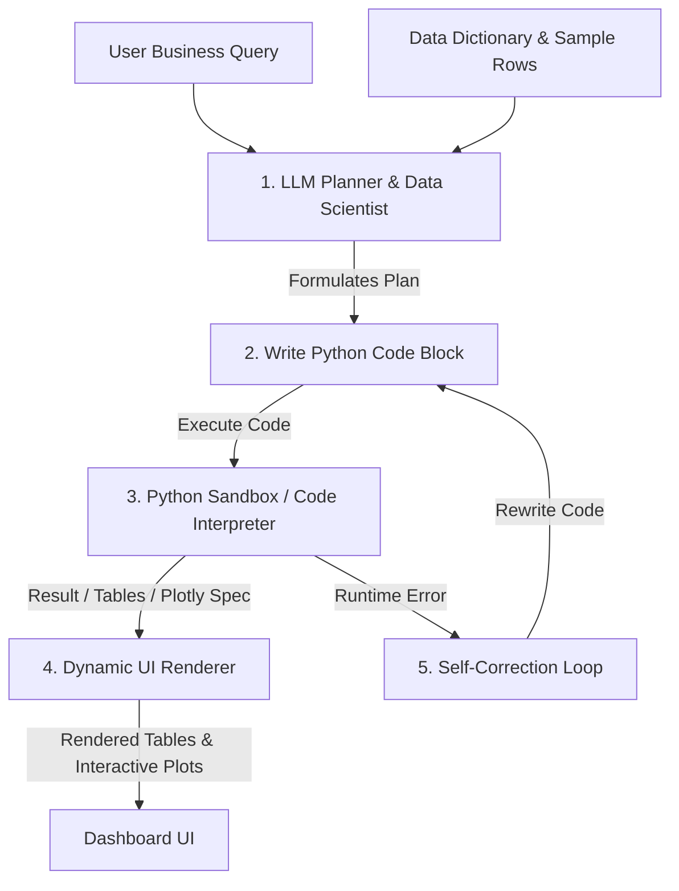

# Architectural Study: Transitioning Omega from Deterministic Pipelines to Agentic Reasoning (Omega V3)

## Executive Summary
Omega V2 succeeded in achieving sub-second speeds for standard descriptors and simulators. However, standard business questions (such as the 20 EV Adoption questions) are exploratory and multi-step. They cannot be solved by mapping a query to a single SQL query or a pre-packaged K-Means template. 

To make Omega an industry-demanded product that replaces Python, SQL, Excel, and Power BI, we must evolve the architecture from a **Deterministic Router** to an **Agentic Data Scientist (Omega V3)**.

---

## The Core Problem: V2 Limitations
The current pipeline parses a query, assigns a single `intent_type` (e.g., `trend`, `regression`, `clustering`), and runs a hardcoded script. 

When applied to the EV Adoption dataset, this approach breaks down on complex questions:
*   **Question 1: Strongest factors influencing EV likelihood?**
    *   *V2 Behavior:* Tries to run a simple 2-column hypothesis test or standard regression.
    *   *Needed:* Calculate correlation coefficients or feature importance (e.g., Random Forest importances) across *six* different metrics, rank them, and plot a sorted bar chart of weights.
*   **Question 4: Optimal charging station coverage required?**
    *   *V2 Behavior:* Attempts to run a SQL query grouping or a simple linear regression.
    *   *Needed:* Bin `nearest_charging_station_km`, calculate mean adoption likelihood per bin, identify the "elbow" point or threshold where adoption rates drop significantly, plot a segmented regression curve, and state the distance threshold.
*   **Question 10: Environmentalists with low EV adoption likelihood?**
    *   *V2 Behavior:* Fails to combine filters.
    *   *Needed:* Query records with high `environmental_awareness_score` but low `ev_adoption_likelihood`, run profile segment analysis, extract key attributes of this subset (e.g., high range anxiety or lack of home charging), and build a cohort card.

---

## Proposed Solution: The Omega V3 Agentic Architecture

We propose replacing the rigid routing system with an autonomous **ReAct (Reasoning + Acting) Agent** equipped with a secure **Python Code Execution Sandbox**.

### 1. Architectural Diagram

### 2. How the Components Work
1.  **LLM Planner (Agent):** Receives the user question, the database dictionary, and a 5-row sample of the dataframe. Instead of picking an "intent", it writes a multi-step Python script to solve the question.
2.  **Python Code Sandbox (Execution Environment):** Executes the generated Python code locally using standard data science libraries (`pandas`, `numpy`, `scipy`, `statsmodels`, `plotly`). The active dataset is loaded in memory as `df`.
3.  **Self-Correction Loop:** If the code fails (e.g., a `KeyError` or type mismatch), the error output is sent back to the LLM planner. The LLM automatically diagnoses the bug and rewrites the script in the same execution turn.
4.  **Dynamic Visualization Protocol:** Instead of writing static files, the generated python script exports results (tables as JSON, charts as Plotly JSON strings) to the output folder, which the dashboard dynamically parses and renders.

---

## How Omega V3 Solves the EV Industry Questions

Here is how Omega V3 would autonomously solve key questions from your analysis sheet:

| Question | Agent's Autonomously Generated Python Plan | Expected UI Output |
| :--- | :--- | :--- |
| **Q1: Strongest factors influencing EV likelihood?** | 1. Calculate the Pearson correlation of `ev_adoption_likelihood` against numerical columns (`annual_income`, `charging_station_accessibility`, `range_anxiety_score`, etc.). 2. Rank features by absolute correlation coefficient. 3. Generate a horizontal bar chart of correlations. | A ranked chart of influence coefficients, showing that `charging_station_accessibility` and `range_anxiety_score` are the leading positive/negative drivers. |
| **Q4: Optimal charging coverage threshold?** | 1. Bin `nearest_charging_station_km` into intervals (0-2km, 2-5km, etc.). 2. Group by bins and calculate the average `ev_adoption_likelihood`. 3. Fit a segmented regression line to find where the slope changes steepest (the "elbow" drop-off). 4. Generate a line chart with a vertical line marking the threshold. | A visual curve showing EV adoption rates plateauing within 3km of a charger, but dropping by 60% once distance exceeds 5km. |
| **Q10: High environmental awareness, low adoption profiles?** | 1. Filter dataset: `environmental_awareness_score > 7` and `ev_adoption_likelihood < 4`. 2. Run descriptive statistics on this subset vs the general population. 3. Calculate the top 3 attributes that deviate most from average (e.g., `home_charging_available == False`). | A cohort profile card highlighting: "Sustainability-minded hesitants are characterized by lack of home charging (87%) and high battery concern scores." |

---

## Technical Feasibility & Security
*   **Security:** Code is executed locally on the user's dataset in a sandbox environment, ensuring zero data leakage.
*   **Execution Time:** Pre-cached data frames and single-pass Python runs will complete in **1.5 to 3.0 seconds**, maintaining V2's performance goals while adding reasoning capabilities.
*   **API Stability:** By prompting the LLM to output clean Plotly specs via `fig.to_json()`, the Streamlit frontend can render standard charts dynamically without hardcoding chart types.
